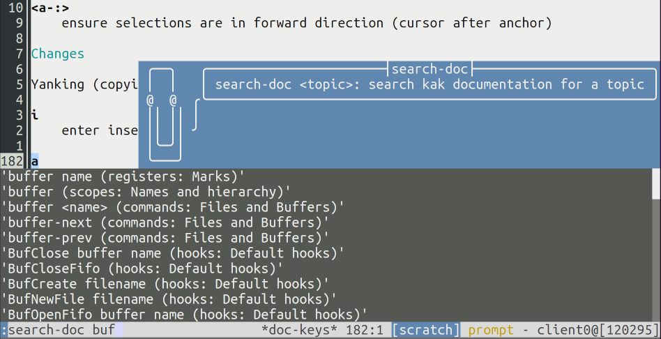

# search-doc.kak

[](https://opensource.org/licenses/Apache-2.0)

**search-doc.kak** is a [Kakoune](https://github.com/mawww/kakoune) plugin that
provides a command for opening the kakoune documentation for a specific item.
The command, `:search-doc`, is an alternative to the built in command `:doc`
and it comes with the advantages that

- it jumps to a much more detailed location, and

- it shows completion options in a more informative way.



## Dependencies

- ruby

## Installation

### With plug.kak

You can install **search-doc.kak** using the
[plug.kak](https://github.com/andreyorst/plug.kak) plugin manager by extending
your `kakrc` with:

```kak
plug "jbomanson/search-doc.kak" defer search-doc %{
    # Optional suggestion:
    alias global sd search-doc
} demand
```

Then restart Kakoune and run `:plug-install`.

### Manually

In your `kakrc`, include:

```sh
source "/path/to/search-doc.kak/rc/search-doc.kak"
require-module search-doc
# Optional suggestion:
alias global sd search-doc
```

## Usage

Use the `:search-doc <topic>` function when intending to browse kakoune
documentation, and enjoy the autocompletion!
